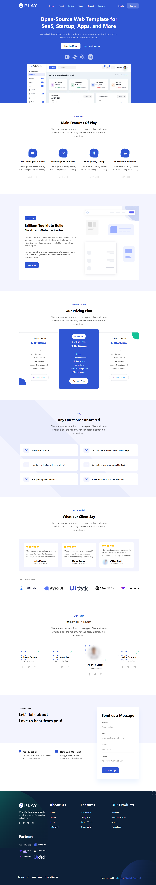

# Play – Web Template

**Play** is a free and open-source web template designed for SaaS, startups, apps, and more. Built with modern technologies like **HTML, CSS, Bootstrap, Tailwind, and React/NextJS**, it helps you create websites faster with a clean and responsive design.

## Features

- Free and Open-Source  
- Multipurpose Template for various projects  
- High-Quality Design and Essential UI Components  
- Fully Responsive and Modern Layouts  

## Pages Included

- Home, About, Pricing, Team, Contact  
- Blog Grid, Blog Details  
- Sign Up, Sign In  
- 404 Page  

## Screenshots

### Home Page

## 🌐 Live Demo

[Play Template Live](https://play-template.netlify.app)

## Author
Abdullah Mohammed Abdullah Alamoudi
ASP.NET Core Developer

Email: abdullah.alamodi99@gmail.com
GitHub: https://github.com/Abdullah-Alamodi99
